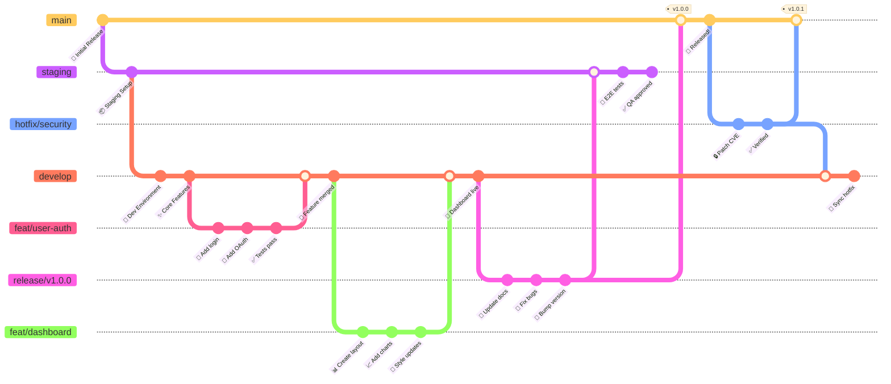
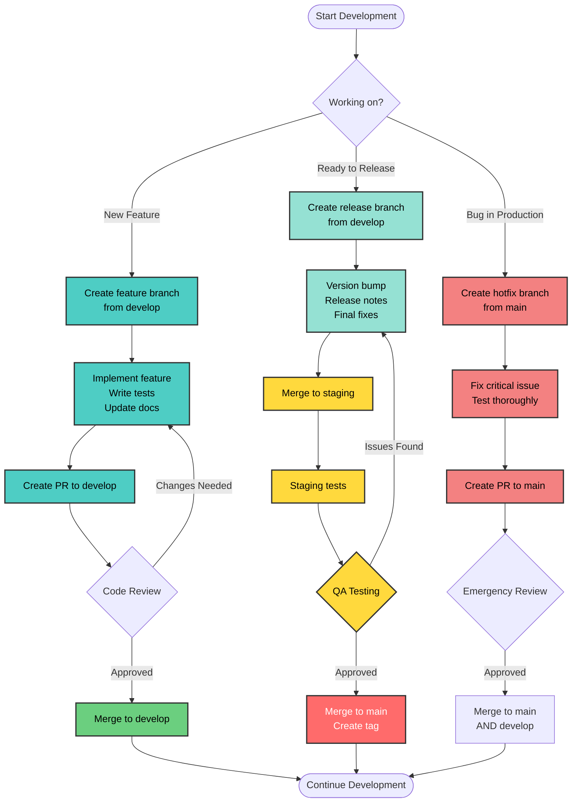
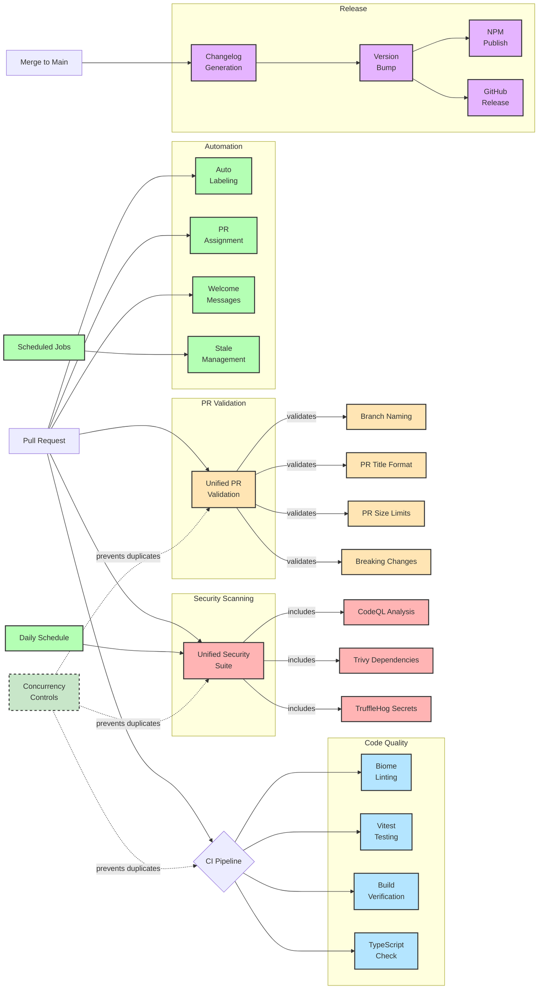

<div align="center">

# 🚀 Zopio Git Flow & CI/CD Pipeline

[](https://github.com/zopiolabs/zopio)
[](https://github.com/zopiolabs/zopio)
[](https://github.com/zopiolabs/zopio)

**The complete guide to Zopio's branching strategy, automated workflows, and development practices**

✨ **Optimized**: 13 streamlined workflows with concurrency controls • 40-50% reduction in GitHub Actions usage

</div>

---

## 🗺️ Quick Navigation

<table>
<tr>
<td>

### 🌳 Git Flow

- [Branch Overview](#-git-flow-overview)
- [Workflow Diagram](#-workflow-diagram)
- [Branch Types](#-branch-descriptions)
- [Protection Rules](#️-branch-protection-rules)

</td>
<td>

### 🤖 CI/CD

- [Pipeline Overview](#-cicd-pipeline-overview)
- [Workflow Matrix](#-workflow-triggers-matrix)
- [Automation](#-automated-dependency-management)
- [Security Scans](#-security-framework)

</td>
<td>

### 📚 Guides

- [Quick Start](#-workflow-steps)
- [Best Practices](#-best-practices)
- [PR Guidelines](#-issue--pr-management)
- [Resources](#-additional-resources)

</td>
</tr>
</table>

---

## ⚡ Quick Reference Card

> **Branch Flow**: `develop` (🔧 integration) → `staging` (🧪 pre-prod) → `main` (🚀 production)

<details>
<summary><b>🎯 Common Commands (Click to expand)</b></summary>

```bash
# Feature Development
git checkout -b feat/awesome-feature develop
git push -u origin feat/awesome-feature

# Create Release
git checkout -b release/v1.2.0 develop

# Emergency Hotfix
git checkout -b hotfix/critical-bug main
```

</details>

---

<div align="center">

## 📊 Git Flow Overview

**Visual representation of our branching strategy**

> **Note**: While the diagram shows branches created in the order main → staging → develop (for technical reasons),
> the actual code flow is **develop → staging → main** as shown in the Quick Reference above.

</div>



---

<div align="center">

## 🔄 Workflow Diagram

**Step-by-step development process**

</div>



---

<div align="center">

## 🤖 CI/CD Pipeline Overview

**Automated quality gates and deployment processes**

</div>



---

## 🚀 Workflow Optimization

<div align="center">

**⚡ Streamlined workflows with 40-50% reduction in GitHub Actions usage**

</div>

<details open>
<summary><b>🔄 Consolidated Workflows</b></summary>

| Original Workflows | → | Optimized Workflow | Benefits |
|:-------------------|:-:|:-------------------|:---------|
| • branch-naming.yml<br>• semantic-pr.yml<br>• pr-size-check.yml | **→** | **pr-validation.yml** | • Single workflow for all PR checks<br>• Reduced API calls<br>• Clearer error messages |
| • codeql.yml<br>• security.yml (partial) | **→** | **security.yml** | • Unified security scanning<br>• Single results dashboard<br>• Consistent scheduling |

</details>

<details>
<summary><b>⚡ Performance Improvements</b></summary>

### Concurrency Controls Added

All major workflows now include:

```yaml
concurrency:
  group: $workflow-${{ github.ref }}
  cancel-in-progress: true
```

### Benefits

- ✅ Automatically cancels outdated runs
- ✅ Prevents duplicate workflow executions  
- ✅ Faster feedback on PRs
- ✅ Significant cost savings

### Archived Workflows

The following files have been archived with `.old` extension:

- `branch-naming.yml.old`
- `semantic-pr.yml.old`
- `pr-size-check.yml.old`
- `codeql.yml.old`

</details>

---

## 📋 Workflow Triggers Matrix

<div align="center">

> **🔍 Quick View**: Which workflows run when and where
>
> **🚀 Optimized**: Consolidated workflows with concurrency controls

</div>

| Workflow | Push to `main` | Push to `develop` | Push to `staging` | Pull Request | Schedule | Manual |
|----------|:--------------:|:-----------------:|:-----------------:|:------------:|:--------:|:------:|
| **CI Pipeline** ¹ | ❌ | ✅ | ✅ | ✅ (develop/staging) | ❌ | ❌ |
| **Build (Bundle Analysis)** ² | ❌ | ❌ | ❌ | ✅ (to main) | ❌ | ❌ |
| **PR Validation** ³ | ❌ | ❌ | ❌ | ✅ | ❌ | ❌ |
| **Security Scan** ⁴ | ✅ | ✅ | ✅ | ✅ | 🕐 Daily | ❌ |
| **Changelog** | ✅ | ❌ | ❌ | ❌ | ❌ | ✅ |
| **Release** | ✅ | ❌ | ❌ | ❌ | ❌ | ❌ |
| **Label PR** | ❌ | ❌ | ❌ | ✅ | ❌ | ❌ |
| **Assign PR** | ❌ | ❌ | ❌ | ✅ | ❌ | ❌ |
| **Welcome** | ❌ | ❌ | ❌ | ✅ | ❌ | ❌ |
| **Stale Issues** | ❌ | ❌ | ❌ | ❌ | 🕐 Daily | ✅ |
| **Lock Threads** | ❌ | ❌ | ❌ | ❌ | 🕐 Daily | ✅ |
| **Docs** | ❌ | ❌ | ❌ | ✅ (docs only) | ❌ | ❌ |

> **Notes:**
>
> - ¹ **CI Pipeline** includes: linting, testing, type checking, and build verification (focused on develop/staging)
> - ² **Build (Bundle Analysis)** runs comprehensive checks with bundle size analysis for PRs to main
> - ³ **PR Validation** consolidates: branch naming, semantic PR titles, PR size checks, and breaking change validation
> - ⁴ **Security Scan** unified workflow includes: CodeQL, Trivy dependency scan, and TruffleHog secret detection
>
> **✨ All workflows include concurrency controls to prevent duplicate runs**

---

## 🌳 Branch Descriptions

<div align="center">

### 🔴 **Protected Main Branches**

</div>

<table>
<tr>
<td width="33%">

#### 🔧 `develop`

**Integration Branch**

```text
Status:    Protected ✓
Reviews:   1 required
Purpose:   Feature Integration
Tests:     Full suite
Latest:    All features
```

</td>
<td width="33%">

#### 🧪 `staging`

**Pre-Production Branch**

```text
Status:    Protected ✓
Reviews:   1 required
Purpose:   QA Testing
Next:      → Production
```

</td>
<td width="33%">

#### 🚀 `main`

**Production Branch**

```text
Status:    Protected ✓
Reviews:   2 required
Team:      @core
Tags:      All releases
```

</td>
</tr>
</table>

<div align="center">

### 🔵 **Supporting Branches**

</div>

<details open>
<summary><b>📐 Branch Naming Conventions</b> (Click to toggle)</summary>

> ⚠️ **Important**: All branches must follow these enforced naming patterns

| Pattern | Purpose | Examples |
|---------|---------|----------|
| `feat/*` or `feature/*` | New features | `feat/user-auth`, `feature/dashboard` |
| `fix/*` | Bug fixes | `fix/login-error`, `fix/data-race` |
| `hotfix/*` | Emergency production fixes | `hotfix/security-patch`, `hotfix/critical-bug` |
| `release/v*.*.*` | Release branches | `release/v1.0.0`, `release/v2.1.0` |
| `docs/*` | Documentation updates | `docs/api-guide`, `docs/readme-update` |
| `chore/*` | Maintenance tasks | `chore/update-deps`, `chore/cleanup` |
| `test/*` | Test additions/fixes | `test/auth-coverage`, `test/e2e-suite` |
| `refactor/*` | Code refactoring | `refactor/auth-module`, `refactor/api-structure` |
| `ci/*` | CI/CD changes | `ci/github-actions`, `ci/deploy-script` |
| `build/*` | Build system changes | `build/webpack-config`, `build/docker` |
| `perf/*` | Performance improvements | `perf/query-optimization`, `perf/bundle-size` |
| `style/*` | Code style/formatting | `style/prettier-config`, `style/lint-rules` |
| `revert/*` | Reverting commits | `revert/feature-x`, `revert/commit-abc123` |
| `sync/*` | Branch synchronization | `sync/upstream-main`, `sync/develop-to-staging` |
| `dependabot/*` | Automated updates | `dependabot/npm/next-15.0.0` |

</details>

<details>
<summary><b>🌟 Feature Branches</b></summary>
- **Created from**: `develop`
- **Merged to**: `develop`
- **Purpose**: New features and enhancements
- **Lifecycle**: Short-lived (1-2 weeks max)

</details>

<details>
<summary><b>📦 Release Branches</b></summary>

- **Created from**: `develop`
- **Merged to**: `staging` → `main`
- **Purpose**: Release preparation and stabilization
- **Activities**: Version bumps, release notes, bug fixes

</details>

<details>
<summary><b>🚨 Hotfix Branches</b></summary>

- **Created from**: `main`
- **Merged to**: `main` + `develop`
- **Purpose**: Critical production fixes
- **Priority**: Emergency fixes only

</details>

---

## 📋 Workflow Steps

<div align="center">

**🛠️ Quick command reference for common workflows**

</div>

<details open>
<summary><b>1️⃣ Feature Development</b></summary>

```bash
# Start new feature
git checkout develop
git pull origin develop
git checkout -b feat/awesome-feature

# Work on feature
git add .
git commit -m "feat: implement awesome feature"
git push origin feat/awesome-feature

# Create PR to develop
# After approval and merge, branch is deleted
```

</details>

<details>
<summary><b>2️⃣ Release Process</b></summary>

```bash
# Start release
git checkout develop
git pull origin develop
git checkout -b release/v1.2.0

# Prepare release
# - Update version numbers
# - Update CHANGELOG.md
# - Fix any last-minute issues

git push origin release/v1.2.0

# Merge to staging for testing
# After QA approval, merge to main
# Tag is automatically created
```

</details>

<details>
<summary><b>3️⃣ Hotfix Process</b></summary>

```bash
# Start hotfix from main
git checkout main
git pull origin main
git checkout -b hotfix/critical-bug

# Fix the issue
git add .
git commit -m "fix: resolve critical bug"
git push origin hotfix/critical-bug

# Create PR to main
# After merge, also merge to develop
```

</details>

---

## 🛡️ Branch Protection Rules

<div align="center">

> **🔐 Security**: All protected branches require passing CI/CD checks

</div>

| Branch | 👥 Reviews | 👤 Reviewers | 🔒 Protection Rules |
|:------:|:----------:|:------------:|:--------------------|
| **develop** | 1 | Any maintainer | • No force push<br>• No deletion<br>• CI Pipeline must pass<br>• CodeQL security scan |
| **staging** | 1 | Any maintainer | • No force push<br>• No deletion<br>• CI Pipeline must pass<br>• CodeQL security scan |
| **main** | 2 | @core team | • No force push<br>• No deletion<br>• CI Pipeline must pass<br>• CodeQL security scan<br>• Up-to-date with base<br>• Semantic PR title |

> **Note**: Branch protection rules are configured in GitHub repository settings and are not visible in the codebase. The rules above represent the recommended configuration. Deployments are handled through Vercel's GitHub integration.

<details open>
<summary><b>🔍 PR Validation Requirements</b></summary>

<table>
<tr>
<td>

#### 📝 Format Checks (pr-validation.yml)

```text
✓ Branch naming conventions
✓ Conventional commit format
✓ PR size limits:
  - Soft: 1000 lines
  - Hard: 5000 lines
  - Max: 100 files
✓ Breaking change docs
✓ All in ONE workflow
```

</td>
<td>

#### ✅ Quality Checks

```text
✓ Biome linting
✓ TypeScript compilation
✓ Vitest test suite
✓ Build verification
✓ Coverage thresholds
✓ Concurrency control
```

</td>
</tr>
<tr>
<td>

#### 🔐 Security Checks (security.yml)

```text
✓ CodeQL analysis
✓ Trivy dependency scan
✓ TruffleHog secrets
✓ Container scanning
✓ Unified reporting
✓ Daily + PR scans
```

</td>
<td>

#### 🤖 Automation

```text
✓ Auto-assign author
✓ Smart labeling
✓ Team assignments
✓ Welcome messages
✓ Duplicate prevention
✓ Stale management
```

</td>
</tr>
</table>

</details>

---

## 🎯 Best Practices

<div align="center">

<table>
<tr>
<td width="50%">

### ✅ **DO**

- 📅 Keep feature branches short-lived (< 2 weeks)
- 💬 Write descriptive [Conventional Commits](https://www.conventionalcommits.org/)
- 👀 Always create PRs for code review
- 🔄 Keep branches up-to-date with base
- 🗑️ Delete branches after merging
- 🏷️ Tag releases with semantic versioning

</td>
<td width="50%">

### ❌ **DON'T**

- 🚫 Push directly to protected branches
- 🙈 Merge without required reviews
- 📅 Create long-lived feature branches
- ⏭️ Skip testing before merging
- 💪 Force push to shared branches
- 🔴 Merge failing CI builds

</td>
</tr>
</table>

</div>

---

## 🔄 Sync Commands

<details>
<summary><b>Keep your branches up-to-date</b></summary>

```bash
# Update feature branch with latest develop
git checkout feat/your-feature
git fetch origin
git rebase origin/develop

# Update develop with latest main (after hotfix)
git checkout develop
git fetch origin
git merge origin/main
```

</details>

---

## 🚀 Release Automation

<div align="center">

**📦 Automated release pipeline with zero manual intervention**

</div>

<details open>
<summary><b>🤖 Automatic Release Process</b></summary>

> When code is merged to `main`, the following happens automatically:

<table>
<tr>
<td width="33%">

#### 1️⃣ Changelog Generation

**TriPSs/conventional-changelog-action**

```text
✓ Analyze commits
✓ Generate CHANGELOG.md
✓ Create version tag
✓ Commit with bot
```

</td>
<td width="33%">

#### 2️⃣ GitHub Release

**actions/create-release**

```text
✓ Create from tag
✓ Include changelog
✓ Publish release
✓ Notify team
```

</td>
<td width="33%">

#### 3️⃣ NPM Publishing

**auto shipit**

```text
✓ Version bump
✓ Publish to NPM
✓ Update packages
✓ Git tags
```

</td>
</tr>
</table>

</details>

---

## 🧹 Repository Maintenance

<div align="center">

**🤖 Automated housekeeping keeps the repository clean and secure**

</div>

<details open>
<summary><b>📅 Automated Housekeeping Schedule</b></summary>

| Task | Schedule | Behavior |
|------|:--------:|----------|
| **🏷️ Stale Issues** | Daily 1 AM UTC | • Mark stale after 60 days<br>• Close after 14 more days<br>• Exempt: security, pinned, help wanted |
| **📑 Stale PRs** | Daily 1 AM UTC | • Mark stale after 30 days<br>• Close after 7 more days<br>• More aggressive than issues |
| **🔒 Lock Threads** | Daily 2 AM UTC | • Lock closed issues after 90 days<br>• Lock closed PRs after 60 days<br>• Prevents necroposting |
| **🔍 Security Scans** | Daily 2 AM UTC | • Dependency vulnerabilities (Trivy)<br>• Secret scanning<br>• SAST analysis |
| **🔵 CodeQL Analysis** | Weekly Mon 3 AM UTC | • JavaScript/TypeScript security analysis<br>• OWASP vulnerability detection<br>• Code quality issues |

</details>

<details>
<summary><b>💥 Breaking Changes</b></summary>

> **Important**: PRs with breaking changes require special handling

For PRs marked with `!`:

- ✍️ PR description must include "Breaking Changes" section
- 📋 Document migration steps
- 💡 Explain why the change is necessary
- 📝 Example: `feat(api)!: change response format`

</details>

---

## 🤖 Automated Dependency Management

<div align="center">

**📦 Dependabot keeps dependencies fresh and secure**

</div>

<details open>
<summary><b>⚙️ Dependabot Configuration</b></summary>

> **Schedule**: Weekly on Mondays at 3 AM UTC

| Ecosystem | Directory | PR Limit | Reviewers | Grouping Strategy |
|:---------:|:---------:|:--------:|:---------:|:-----------------|
| **npm** (root) | `/` | 10 | @repo/core | Dev deps grouped |
| **npm** (packages) | `/packages/*` | 5 | @repo/core | By package |
| **npm** (apps) | `/apps/*` | 5 | @repo/core | By app |
| **Actions** | `/` | - | @repo/core | All actions |

</details>

<details>
<summary><b>📦 Dependency Grouping Rules</b></summary>

#### Automatically Grouped Updates

- 🔧 **ESLint**: All `*eslint*` packages
- 🎨 **Prettier**: All `*prettier*` packages
- 📘 **TypeScript**: All `*typescript*` & `@types/*`
- 🔄 **Scope**: Minor and patch updates only

#### Labels Applied

- 🏷️ `dependencies` - All dependency updates
- 📦 `npm` - NPM package updates
- 📁 `packages` - Updates in packages directory
- 📱 `apps` - Updates in apps directory
- 🤖 `github-actions` - GitHub Actions updates

</details>

---

## 👥 Code Ownership (CODEOWNERS)

<div align="center">

**🛡️ Team-based code ownership with core team oversight**

</div>

<details open>
<summary><b>🔍 Team Structure & Responsibilities</b></summary>

> **Base Requirement**: All files require `@zopiolabs/core-team` review unless overridden

<table>
<tr>
<th>Team</th>
<th>Areas of Responsibility</th>
<th>Critical Paths</th>
</tr>
<tr>
<td><code>@zopiolabs/dx-team</code></td>
<td>Development Experience & Backend Logic</td>
<td>🔐 Authentication, 💾 Database, 🔌 API, 📊 Data</td>
</tr>
<tr>
<td><code>@zopiolabs/ux-team</code></td>
<td>User Experience & Interfaces</td>
<td>🎨 Design System, 🌐 Web Apps, 📱 UI Components</td>
</tr>
<tr>
<td><code>@zopiolabs/docs-team</code></td>
<td>Documentation & Learning Resources</td>
<td>📚 Documentation Portal, 📝 README files, 📜 Changelogs</td>
</tr>
<tr>
<td><code>@zopiolabs/product-team</code></td>
<td>Product Features & Business Logic</td>
<td>📊 Analytics, 💳 Payments, 🤖 AI, 🚩 Feature Flags</td>
</tr>
<tr>
<td><code>@zopiolabs/infra-team</code></td>
<td>Infrastructure & DevOps</td>
<td>⚙️ CI/CD, 🔒 Security, 🔧 CLI Tools, 📦 Build Config</td>
</tr>
</table>

</details>

<details>
<summary><b>⚙️ Critical Path Examples</b></summary>

<table>
<tr>
<th>Path Pattern</th>
<th>Owning Team</th>
<th>Why Critical</th>
</tr>
<tr>
<td><code>/packages/auth/</code></td>
<td>DX Team</td>
<td>🔐 Security-critical authentication</td>
</tr>
<tr>
<td><code>/packages/database/</code></td>
<td>DX Team</td>
<td>💾 Data integrity and persistence</td>
</tr>
<tr>
<td><code>/packages/design-system/</code></td>
<td>UX Team</td>
<td>🎨 Core UI components used everywhere</td>
</tr>
<tr>
<td><code>/.github/workflows/</code></td>
<td>Infra Team</td>
<td>⚙️ CI/CD pipeline configuration</td>
</tr>
<tr>
<td><code>/packages/analytics/</code></td>
<td>Product Team</td>
<td>📊 Business metrics and reporting</td>
</tr>
<tr>
<td><code>/apps/docs/</code></td>
<td>Docs Team</td>
<td>📚 Official documentation portal</td>
</tr>
</table>

</details>

<details>
<summary><b>🔧 Monorepo Configuration Files</b></summary>

The following files affect the entire monorepo and are owned by the Infra Team:

- 🔧 `/turbo.json` - Turborepo configuration
- 📦 `/pnpm-workspace.yaml` - Workspace configuration  
- 📄 `/package.json` - Root package configuration
- 📘 `/tsconfig.json` - TypeScript configuration
- 🧹 `/biome.json` - Code formatting and linting rules
- 🔄 `/tsup.config.ts` - Build configuration

> **Note**: All configuration changes require review from both Infra Team and Core Team

</details>

---

## 🏷️ Label System

<div align="center">

**🎨 41 predefined labels for clear issue and PR organization**

</div>

<details open>
<summary><b>🎨 Type Labels</b> (Auto-applied based on PR title)</summary>

| Label | Color | Applied When |
|:------|:-----:|:-------------|
| `type: feature` | 🟢 | PR title starts with `feat:` |
| `type: fix` | 🔴 | PR title starts with `fix:` |
| `type: documentation` | 🔵 | PR title starts with `docs:` |
| `type: chore` | 🟡 | PR title starts with `chore:` |
| `type: test` | 🟡 | PR title starts with `test:` |
| `type: refactor` | 🟣 | PR title starts with `refactor:` |
| `type: performance` | 🟠 | PR title starts with `perf:` |
| `type: ci` | 🟢 | PR title starts with `ci:` |
| `type: build` | 🔵 | PR title starts with `build:` |

</details>

<details>
<summary><b>🎯 Priority Labels</b></summary>

| Label | Color | Description |
|:------|:-----:|:------------|
| `priority: critical` | 🔴 | Requires immediate attention |
| `priority: high` | 🟠 | Important, address soon |
| `priority: medium` | 🟡 | Normal priority |
| `priority: low` | 🟢 | Can wait |

</details>

<details>
<summary><b>📊 Status Labels</b></summary>

| Label | Color | Description |
|:------|:-----:|:------------|
| `status: ready for review` | 🟢 | PR is ready for review |
| `status: in progress` | 🟡 | Work in progress |
| `status: blocked` | 🔴 | Blocked by dependencies |
| `status: needs discussion` | 🟣 | Requires team discussion |

</details>

<details>
<summary><b>✨ Special Labels</b></summary>

| Label | Color | Description |
|:------|:-----:|:------------|
| `good first issue` | 🟣 | Perfect for newcomers |
| `help wanted` | 🟢 | Community help appreciated |
| `breaking change` | 🔴 | Contains breaking changes |
| `community contribution` | 🔵 | From external contributor |
| `security` | 🔴 | Security-related |
| `stale` | ⚪ | Inactive for 30-60 days |

</details>

<details>
<summary><b>📦 Package/App Labels</b> (Auto-applied)</summary>

Labels automatically applied based on changed files:

- 📦 **Packages**: `package: core`, `package: auth`, `package: database`
- 📱 **Apps**: `app: api`, `app: web`, `app: docs`
- 📝 **Other**:
  - `documentation` - Markdown files
  - `dependencies` - Package.json changes
  - `testing` - Test file changes
  - `ci/cd` - Workflow changes
  - `i18n` - Internationalization
  - `infrastructure` - Docker/infra

</details>

<details>
<summary><b>⚙️ Label Automation Flow</b></summary>

1. **🆕 On PR Open**: Type labels based on title, path-based labels
2. **🔄 On PR Update**: Re-evaluate labels based on changes
3. **✋ Manual Labels**: Priority, status, and special labels
4. **🕰️ Stale Process**: Automatically adds `stale` label

</details>

---

## 📝 Issue & PR Management

<div align="center">

**📋 Structured templates for efficient collaboration**

</div>

<details open>
<summary><b>🐛 Issue Templates</b></summary>

<table>
<tr>
<th>Template</th>
<th>Purpose</th>
<th>Key Fields</th>
</tr>
<tr>
<td><b>🐛 Bug Report</b></td>
<td>Report bugs</td>
<td>Steps to reproduce, expected vs actual, environment</td>
</tr>
<tr>
<td><b>✨ Feature Request</b></td>
<td>Suggest features</td>
<td>Problem statement, proposed solution, alternatives</td>
</tr>
<tr>
<td><b>💡 Enhancement</b></td>
<td>Improve existing</td>
<td>Current behavior, desired improvement</td>
</tr>
<tr>
<td><b>📚 Documentation</b></td>
<td>Doc improvements</td>
<td>What's unclear, suggested changes</td>
</tr>
<tr>
<td><b>❓ Question</b></td>
<td>Ask questions</td>
<td>Context, specific question</td>
</tr>
</table>

</details>

<details>
<summary><b>📋 PR Template Requirements</b></summary>

#### Required Information

- 📝 **Description**: Brief summary of changes
- 🏷️ **Type of Change**: Bug fix, feature, breaking change, etc.
- 🔗 **Related Issues**: Link with `Closes #<issue>`
- 📸 **Screenshots**: For UI changes

#### PR Checklist

```markdown
- [ ] Code follows project style
- [ ] Self-review completed
- [ ] Comments for complex code
- [ ] Documentation updated
- [ ] Tests added/updated
- [ ] Tests pass locally
- [ ] pnpm lint passes
- [ ] Conventional commits used
```

</details>

<details>
<summary><b>🎉 First-Time Contributors</b></summary>

Welcome messages automatically posted:

- **🆕 First Issue**: Links to contributing guidelines
- **🎊 First PR**: Detailed next steps and acknowledgment

External links provided:

- 💬 **GitHub Discussions** - General questions
- 📚 **Documentation** - Project docs
- 🤝 **Support** - Community channels

</details>

---

## 🔒 Security Framework

<div align="center">

**🛡️ Comprehensive security measures to protect your code**

</div>

<details open>
<summary><b>🚨 Vulnerability Reporting</b></summary>

> ⚠️ **IMPORTANT**: DO NOT open public issues for security vulnerabilities

<table>
<tr>
<td width="50%">

### 1️⃣ GitHub Security Advisories (Preferred)

```text
1. Go to Security Advisories
2. Click "Report a vulnerability"
3. Provide detailed information
```

[Report Here →](https://github.com/zopiolabs/zopio/security/advisories)

</td>
<td width="50%">

### 2️⃣ Private Email

```text
Email: security@zopio.dev
PGP: Available for encryption
Response: Within 48 hours
```

</td>
</tr>
</table>

</details>

<details>
<summary><b>🔍 Security Scanning Suite</b></summary>

> **✨ Unified Security Workflow**: All security scans now run in a single `security.yml` workflow

| Scanner | Type | Schedule | Checks For |
|:--------|:----:|:--------:|:-----------|
| **🔵 CodeQL** | SAST | PR + Daily | JavaScript/TypeScript vulnerabilities |
| **🐳 Trivy** | Dependencies | PR + Daily | Known CVEs in dependencies |
| **🐗 TruffleHog** | Secrets | PR + Daily | Exposed credentials, API keys |
| **🤖 Dependabot** | Updates | Weekly | Outdated dependencies |

**Key Improvements:**

- 🚀 Single workflow for all security scans
- 📊 Unified SARIF reporting to Security tab
- ⚡ Concurrency control prevents duplicate scans
- 🔄 Consistent scheduling across all scanners

</details>

<details>
<summary><b>✅ Security Requirements for PRs</b></summary>

```markdown
- [ ] No hardcoded secrets or credentials
- [ ] All user inputs are validated
- [ ] Authentication properly implemented
- [ ] Authorization checks in place
- [ ] Error messages don't leak sensitive info
- [ ] Dependencies are up to date
- [ ] Security headers configured
- [ ] Rate limiting implemented where needed
```

</details>

<details>
<summary><b>🛡️ Security Best Practices</b></summary>

<table>
<tr>
<td>

**Authentication & Access**

- 🔐 Use Clerk for all auth
- 🚫 Implement rate limiting via Arcjet
- ✅ Validate all user inputs

</td>
<td>

**Data & Secrets**

- 🔑 Environment variables only
- 📊 Parameterized queries
- 🙊 Generic error messages

</td>
</tr>
</table>

</details>

<details>
<summary><b>⏱️ Security Response Timeline</b></summary>

| Event | Timeline | Details |
|:------|:--------:|:--------|
| **👋 Acknowledgment** | 48 hours | Initial response |
| **🚑 Critical Issues** | 7 days | Fix deployed |
| **📢 Disclosure** | 90 days | Responsible disclosure |
| **🏆 Credit** | Varies | With permission |

**Supported Versions:**

- ✅ **1.x.x** - Active security support
- ❌ **< 1.0.0** - No security support

</details>

---

## 📚 Additional Resources

<div align="center">

**📖 Everything you need to contribute successfully**

</div>

<details open>
<summary><b>📄 Repository Documentation</b></summary>

| Document | Purpose |
|:---------|:--------|
| 📋 [BRANCHES.md](../policies/BRANCHES.md) | Quick branch reference guide |
| 💬 [CONVENTIONAL_COMMITS.md](../policies/CONVENTIONAL_COMMITS.md) | Commit message format |
| 🤝 [CONTRIBUTING.md](../CONTRIBUTING.md) | Contribution guidelines |
| 👥 [CODE_OF_CONDUCT.md](../CODE_OF_CONDUCT.md) | Community standards |
| 🔒 [SECURITY.md](../SECURITY.md) | Security policy details |
| 💭 [DISCUSSIONS.md](../policies/DISCUSSIONS.md) | Discussion guidelines |

</details>

<details>
<summary><b>⚙️ Configuration Files</b></summary>

| File | Purpose |
|:-----|:--------|
| 👥 `.github/CODEOWNERS` | Code review assignments |
| 🤖 `.github/dependabot.yml` | Dependency automation |
| 🏷️ `.github/labeler.yml` | Auto-labeling rules |
| 🎨 `.github/labels.json` | Label definitions |

</details>

---

<div align="center">

### 💡 **Pro Tip**

> Use GitHub's PR templates and branch protection rules to enforce this workflow automatically!

**[⬆ Back to Top](#️-quick-navigation)**

</div>
